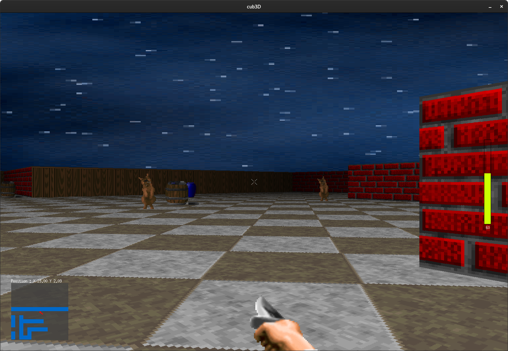

# cub3D

First person shooter inspired of Wolfensteind 3D using raycasting.

# Prerequisites

This project has only been tested on Ubuntu 20.04, it also works on xubuntu (VM used by 42). It kinda works on OSX but there will be leaks as MiniLibX is outdated on OSX. Even though you wanna use it on a mac you'll have to remove some functions in ```srcs/mlx_utils/mlx_manager.c``` same for ```bonus/srcs/mlx_utils/mlx_manager.c```.<br>

/!\ The game might be very laggy on high resolution as it's monothreaded. /!\

# Game

Im my cub3D version there's no objective, I just wanted to have the bonus so I could flex on my friends y'know. Though you can kill all the sprites (even the ones who don'teven look dangerous).



# Running the game

If you want to run the mandatory part only use ```make```. For the bonus part (which looks much nicer) use ```make bonus```. Careful ! If you want to run the bonus part after making the mandatory part you have to ```make fclean``` before !<br>

Then you have to specify a map. ```maps/test.cub``` is for the bonus part and ```maps/test_norm.cub``` for the mandatory part.

Your texture will turn into a skybox for the ceiling if the name begins with sky. Otherwise it will behave as a normal ceiling texture.

# Controls

You can move in the map using `W` `A` `S` `D`<br>
You can rotate your camera up, down, left & right using the directional arrows<br>
You can stab a sprite using `R`<br>
You can untoggle your crosshair using `X`<br>
You can run & sneak using `Left CTRL` `SHIFT`<br>
You can interact with doors using `E`<br>
To quit the program properly wether use `ESC` or click the red cross (careful it will only work on Linux).

# Tutorial used for an efficient Raycasting
Lodev Raycasting : https://lodev.org/cgtutor/raycasting.html 
